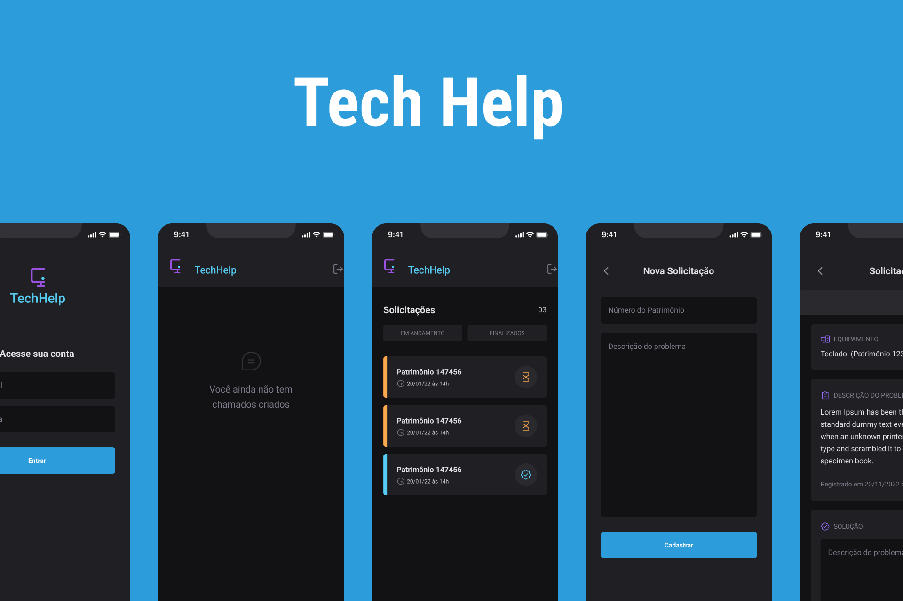

# Tech Help App

TechHelp is an app for opening, organizing, viewing and tracking tech 
help orders.

   
  

### Features
  - Create your account
  - Sign in
  - View your orders list
  - Filter your order by status
  - Create new orders
  - View an order details
  - Describe order solutions
  - Realtime data updates by [Firebase Firestore](https://firebase.google.com/products/firestore).
  - Works offline, thanks for [Firebase Firestore](https://firebase.google.com/products/firestore).

 

### Incoming Features
  - (Web) Dashboard 
  - (Web) Admin access
  - (Web and Mobile) Tech team access

 

### Tech stack

This app was made using the technologies listed bellow.

 

- Typescript
- React Native
- Expo
- Google Firebase

The ui was made on top of [Native Base UI](https://nativebase.io/)

